## Simulation Waveforms

The RTL designs were verified using Verilog testbenches and simulated to generate VCD waveforms. Selected simulation results are shown below.

### Combinational Logic

<table>
<tr>
<td align="center"><b>4:1 Multiplexer</b></td>
<td align="center"><b>Carry Look-Ahead Adder</b></td>
</tr>
<tr>
<td>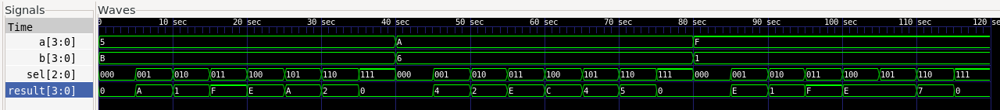</td>
<td>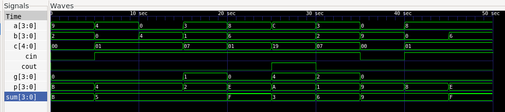</td>
</tr>

<tr>
<td align="center"><b>Combinational Logic</b></td>
<td align="center"><b>Comparator</b></td>
</tr>
<tr>
<td>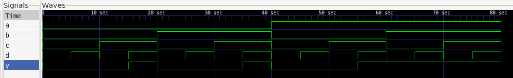</td>
<td>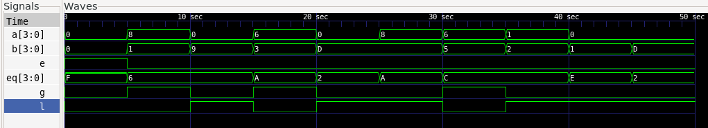</td>
</tr>

<tr>
<td align="center"><b>Full Adder</b></td>
<td align="center"><b>Half Adder</b></td>
</tr>
<tr>
<td>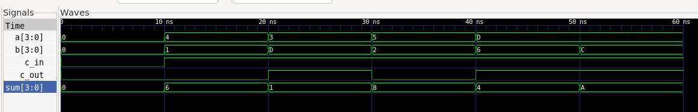</td>
<td>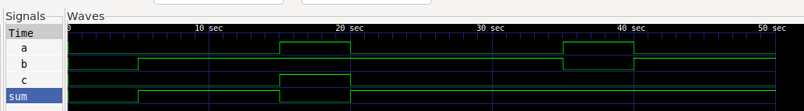</td>
</tr>
</table>

### Sequential Logic

<table>
<tr>
<td align="center"><b>D Flip-Flop</b></td>
<td align="center"><b>Resettable D Flip-Flop</b></td>
</tr>
<tr>
<td>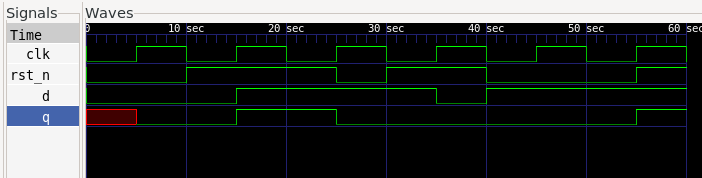</td>
<td>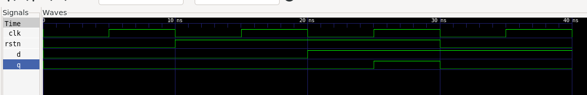</td>
</tr>

<tr>
<td align="center"><b>JK Flip-Flop</b></td>
<td align="center"><b>T Flip-Flop</b></td>
</tr>
<tr>
<td>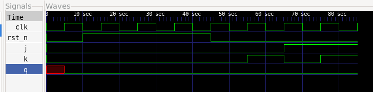</td>
<td>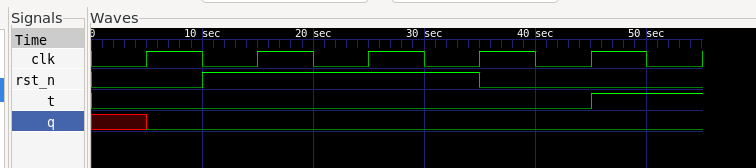</td>
</tr>

<tr>
<td align="center"><b>Shift Register</b></td>
<td align="center"><b>Up/Down Counter</b></td>
</tr>
<tr>
<td>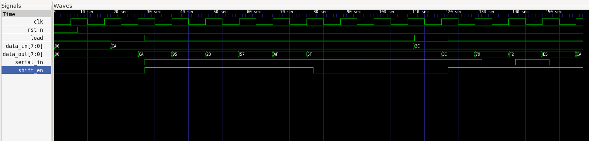</td>
<td>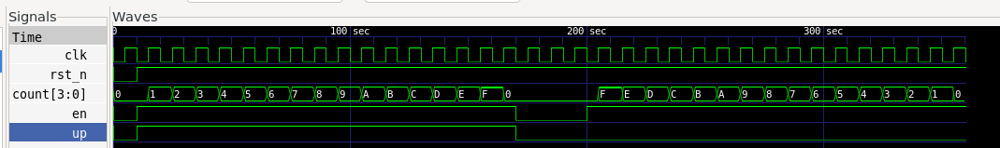</td>
</tr>
</table>

### Additional Digital Circuits

<table>
<tr>
<td align="center"><b>Parity Logic</b></td>
<td align="center"><b>Priority Encoder</b></td>
</tr>
<tr>
<td>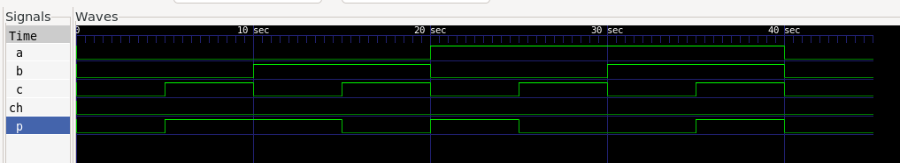</td>
<td>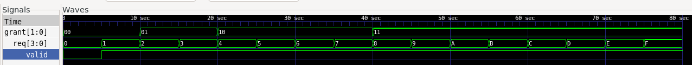</td>
</tr>
</table>
